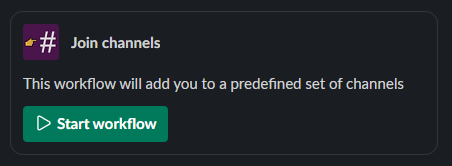

# Slack Channel Inviter

This workflow will add the calling user to a predefined set of channels.

## Installation

This app uses the [new Slack platform](https://api.slack.com/future), meaning everything is hosted within Slack - so no cloud resources or other hosting is required.

To deploy the workflow, follow these steps:

1. Install and configure the [Slack CLI](https://api.slack.com/automation/cli/install)
1. Replace the placeholder channel IDs in [`channels.ts`](./channels.ts) with the IDs of the channels you want the workflow to invite users to
    - If you don't already have the [Slack Developer Tools](https://sdt.builtbyslack.com/) app installed, it's an easy way of gathering channel IDs. They can also be found in a channels' details view.
1. Deploy the app to the Slack Platform with `slack deploy`, creating the trigger when prompted
1. Take the trigger URL outputted by the Slack CLI, and send that in the relevant place for your users
    - That could be just sending it in channel, adding it as a channel bookmark, or placing it in a Canvas
1. Invite the app to the _source_ channel of the workflow invocations with `/invite @Channel Inviter`

## Usage

Once installed, users can execute the workflow with the link provided as above, and will then be added to the specified channels.

